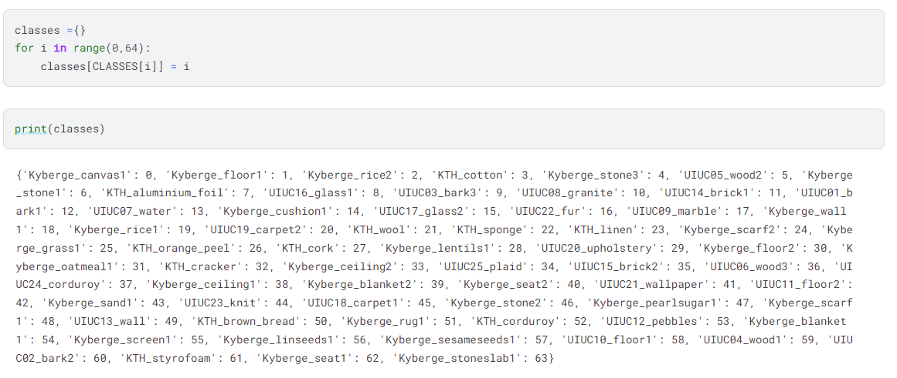

# Texture_Surface_classification
# Texture_Surface_classification
## 1. Introduction
  This project aim to classify the texture class using texture surface image and 
the tool used for classification in this project will be Convolution Neural Network.
## 2. Methodology
### 2.1 Import library
```sh
import cv2
import datetime
import numpy as np
import pandas as pd
import tensorflow as tf
import os

import seaborn as sns
import matplotlib.pyplot as plt
import matplotlib.gridspec as gridspec
%matplotlib inline
import matplotlib.image as mpimg
import sys
import warnings
if not sys.warnoptions:
    warnings.simplefilter("ignore")

from random import randint
from sklearn.utils import shuffle
from sklearn.model_selection import train_test_split
from sklearn.metrics import classification_report, confusion_matrix

from tensorflow.keras import layers
from tensorflow.keras import Model, Sequential
from tensorflow.keras.utils import plot_model
from tensorflow.keras.callbacks import ReduceLROnPlateau
from tensorflow.keras.preprocessing.image import ImageDataGenerator
from tensorflow.keras.models import Sequential
```

### 2.2 Data preprocessing
#### 2.2.1 get the name of all available class in the data and create the class dictionary
```sh
CLASSES, count = [], [] # names of classes, count of images for each class

for root, dirs, files in os.walk('/kaggle/input/deep-pj-data/train'):
    f = os.path.basename(root)    # get class name    
        
    if len(files) > 0:
        count.append(len(files))
        if f not in CLASSES:
            CLASSES.append(f)
classes ={}
for i in range(0,64):
    classes[CLASSES[i]] = i
print(classes)
```

  As a result, we will get a dictionary with 64 classes.
#### 2.2.2 Divided data to train, validation and test
In this process we divided data in to 50% for training and 50% 
for testing and we divided the 50% of testing data into 30% for validation 
data and the rest will be testing data. After that, we prune the data so it can 
be divided evenly according to the batch size we setting.
```sh
def shuffle_prune(df, BATCH_SIZE):
    df = shuffle(df, random_state=42)
    df.reset_index(drop=True, inplace=True)
    df = df[ : df.shape[0] // BATCH_SIZE * BATCH_SIZE]
    return df
filenames = tf.io.gfile.glob('/kaggle/input/deep-pj-data/train/*/*')
image_path_df_train = pd.DataFrame(data={'filename': filenames, 'class': [x.split('/')[-2] for x in filenames]})
image_path_df_train = shuffle_prune(image_path_df_train, BATCH_SIZE)
image_path_df_train['class'] = image_path_df_train['class'].map(classes)
print('Train sample: ', len(image_path_df_train['class']), 
      dict(image_path_df_train['class'].value_counts()))
filenames = tf.io.gfile.glob('/kaggle/input/deep-pj-data/valid/*/*')
image_path_df_test = pd.DataFrame(data={'filename': filenames, 'class': [x.split('/')[-2] for x in filenames]})
image_path_df_test, image_path_df_val  = train_test_split(image_path_df_test, test_size=0.3, random_state=10, stratify=image_path_df_test['class'])
image_path_df_test = shuffle_prune(image_path_df_test, BATCH_SIZE)
image_path_df_test['class'] = image_path_df_test['class'].map(classes)

image_path_df_val = shuffle_prune(image_path_df_val, BATCH_SIZE)
image_path_df_val['class'] = image_path_df_val['class'].map(classes)

print('Test sample: ', len(image_path_df_test['class']), 
      dict(image_path_df_test['class'].value_counts()))
print('Val  sample: ', len(image_path_df_val['class']), 
      dict(image_path_df_val['class'].value_counts()))
```


#### 2.2.3 Get image and label array
In this process we access the image using cv2 library to read the 
image file and then we will transform an image in to array and get it label.
```sh
def get_images_and_labels_arrays(df):
    images = []
    for file in df['filename']:
        image = cv2.imread(file)
        image = cv2.resize(image,IMAGE_SIZE)      
        images.append(image)
    images = np.array(images)
    
    labels = df.loc[:, 'class']
    return images, labels
train_images, train_labels = get_images_and_labels_arrays(image_path_df_train)

print(f'Shape of train set: {train_images.shape}')
print(f'Shape of train set: {train_labels.shape}')
print('Example of image in array',train_images[0,::])
```

#### 2.2.4 Model
```sh
BATCH_SIZE = 32
EPOCHS = 50
IMAGE_SIZE = (150, 150)

tf.random.set_seed(0)
def create_model():
    
    with tf.device('/gpu:0'):
    
        input_layer = layers.Input(shape=(*IMAGE_SIZE, 3), name='input') 
        x = layers.BatchNormalization()(input_layer)

        x = layers.Conv2D(filters=64, kernel_size=3, 
                          activation='relu', padding='same', 
                          name='conv2d_1')(x)
        x = layers.MaxPool2D(pool_size=2, name='maxpool2d_1')(x)
        x = layers.Dropout(0.1, name='dropout_1')(x)
        
        x = layers.Conv2D(filters=64, kernel_size=3, 
                          activation='relu', padding='same', 
                          name='conv2d_2')(x)
        x = layers.MaxPool2D(pool_size=2, name='maxpool2d_2')(x)
        x = layers.Dropout(0.1, name='dropout_2')(x)
        
        x = layers.GlobalAveragePooling2D(name='global_average_pooling2d')(x)
        x = layers.BatchNormalization()(x)
        
        x = layers.Dense(128,activation='relu')(x)
        
        output = layers.Dense(units=len(classes), 
                              activation='softmax', 
                              name='output')(x)


        model = Model (input_layer, output)    
        model.compile(optimizer='adam', 
                      loss='sparse_categorical_crossentropy', 
                      metrics=['accuracy'])

    return model

model = create_model()
model.summary()
```


I created the model having 2 convolution layers which have 64 filters, 
3 x 3 kernel size and pool size equal to 2 on both layer and using global average 
pooling technique instead of flatten method. For the fully connected layer have 128 
nodes inside this layer with relu activation function and the output layer have 64 
nodes and having SoftMax as activation function. In the model compile section I 
using adam optimizer, sparse categorical crossentropy as loss function and has 
accuracy as metrics.
## 3. Result


The accuracy of trained model is 0.9412


After insert testing data into the trained model we found that the model 
accuracy will be 0.9365 and loss will be 0.2434. Here is the example of predicted 
image and it class.


## 4.Model Evaluation


From the above table we can say that the model can classify texture class 
using texture surface image however, in some class the model can not predict it 
correctly which may cause from the data we use to train model is not balance in 
some class because we random separate it.
Reference
- GlobalAveragePooling2D vs Flatten on pretrained model
Link : https://github.com/keras-team/keras/issues/8470
- Textures Classification dataset
Link : https://github.com/abin24/Textures-Dataset
